 

I build **verifiable systems** — software you don't have to believe.

Most code asks for your trust. Mine hands you the receipt. The projects below are one idea seen through different glass: *you should never have to take the code's word for it.* Every claim ships with the means to check it — clone it, run it, watch it prove itself.

`glass prove` emits a proof · a **second, independent** verifier re-checks it · `ACCEPT`

## Selected work

> Not a portfolio. Evidence.

#### → [Glass](https://github.com/EgorKhaklin/Glass) &nbsp;`flagship`

A self-hosting verifiable functional language. **Its compiler is written in Glass and self-compiles to byte-identical C** — then carries a from-scratch zero-knowledge STARK prover whose proofs are re-checked by a *second, independent* verifier. 422/422 tests. Runs in the browser.

*You can see straight through it.* &nbsp;·&nbsp; `language` · `zk-STARK` · `self-hosting`

 

#### → [glass-private-intelligence](https://github.com/EgorKhaklin/glass-private-intelligence)

Verifiable analytics over data you never reveal. Commit a sensitive dataset; anyone runs an aggregate query and gets the answer **plus a zero-knowledge proof it's the true result** — revealing the commitment, the query, and the answer. Never a row.

*Built on Glass · educational-grade crypto, by honest design.* &nbsp;·&nbsp; `ZK` · `private analytics`

 

#### → [polaris-id](https://github.com/EgorKhaklin/polaris-id)

A national identity-token reference implementation. Post-quantum signing, zero-knowledge by default, **compulsion-resistant by construction** — it can't betray you, because it was never built able to.

*Identity that survives coercion.* &nbsp;·&nbsp; `post-quantum` · `ZK`

 

|  |  |  |
|:--|:--|:--|
| **[chaos-one](https://github.com/EgorKhaklin/chaos-one)** | Browser-rendered, Iron-Dome-flavoured air &amp; missile defense — procedural threat waves, four batteries, lead-angle quadratic guidance, continuous weapon–target assignment. | `real-time` |
| **[cassandra-us](https://github.com/EgorKhaklin/cassandra-us)** | Real-time US political sentiment intelligence on a 3D geospatial console. | `Next.js · r3f` |
| **[olympus-ai](https://github.com/EgorKhaklin/olympus-ai)** | A cognitive substrate for AI agents, organized as Greek mythology. | `beta` |

**Every claim on this page is a command you can run.**

Don't trust the description. Clone it, build it, verify the proof.

 

Egor Khaklin &nbsp;·&nbsp; [@EgorKhaklin](https://github.com/EgorKhaklin) &nbsp;·&nbsp; proof over trust

